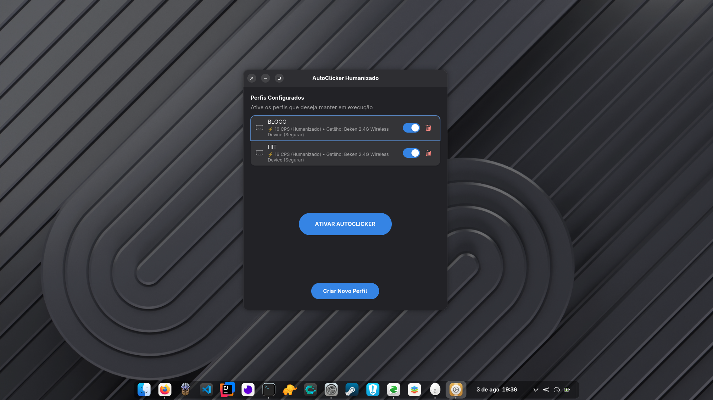
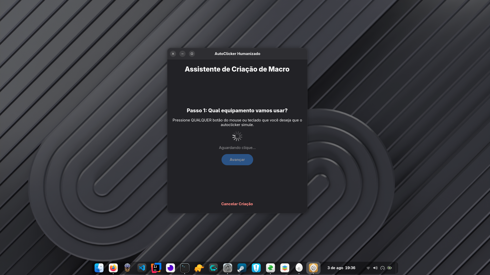

# AutoClicker Humanizado GUI


Nota: Esta aplicação tem como intuito o aprendizado para criar aplicações nativas para Linux mantendo a estética do GNOME e a fidelidade de estilização.

Um AutoClicker moderno e humanizado desenvolvido em Rust com GTK4, Libadwaita e Relm4, projetado especificamente para o ambiente de trabalho GNOME e ecossistema Linux.

---

## Screenshots

| Perfis Configurados | Assistente de Criação de Macro |
| :---: | :---: |
|  |  |

---

## Estrutura do Código e Arquitetura

A aplicação segue uma separação clara entre a camada de apresentação (Interface) e a regra de negócio (Engine de cliques e eventos):

```
                                +---------------------------+
                                |      Ponto de Entrada     |
                                |       (src/main.rs)       |
                                +-------------+-------------+
                                              |
                                              v
                                +---------------------------+
                                |    Camada de Interface    |
                                |       (src/ui/mod.rs)     |
                                +------+-------------+------+
                                       |             |
                     +-----------------+             +-----------------+
                     |                                                 |
                     v                                                 v
       +---------------------------+                     +---------------------------+
       |   Camada de Configuração  |                     |  Engine (Regra de Negócio)|
       |   (src/config.rs &        |                     |      (src/engine/mod.rs)  |
       |    src/profiles/mod.rs)   |                     +--------------+------------+
       +---------------------------+                                    |
                                                                        v
                                                         +---------------------------+
                                                         | Dispositivos de Entrada   |
                                                         |       (/dev/input/*)      |
                                                         +---------------------------+
```

### Detalhamento dos Componentes

#### 1. Camada de Interface (Apresentação)
- `src/ui/mod.rs`: Implementa a interface gráfica reativa em GTK4 e Libadwaita utilizando o framework Relm4. Gerencia janelas, componentes visuais, assistente interativo de configuração de macros e atualização de estados visuais.

#### 2. Regra de Negócio (Engine)
- `src/engine/mod.rs`: Contém toda a lógica central de funcionamento do autoclicker:
  - Captura nativa de eventos de teclado e mouse usando a biblioteca `evdev`.
  - Algoritmo de simulação humanizada com distribuição estatística de tempo entre cliques (evitando padrões robóticos).
  - Controle assíncrono e gerenciamento de threads de execução (Hold/Toggle).

#### 3. Gestão de Dados e Configuração
- `src/config.rs`: Define as estruturas de dados para modos de clique (Humanizado, Fixo, Duplo Clique) e tipos de gatilho.
- `src/profiles/mod.rs`: Gerencia a leitura, escrita e persistência dos perfis de autoclicker no formato JSON.

---

## Funcionalidades

- Interface Nativa GNOME: Construída com Libadwaita garantindo integração visual com o sistema operacional.
- Modo Humanizado: Variações estatísticas de tempo entre cliques para simular comportamento humano real.
- Assistente Interativo: Passo a passo para captura automática de botões de gatilho e ação.
- Modos de Disparo: Suporte a segurar (Hold) e alternar (Toggle).
- Gerenciamento de Perfis: Salve e alterne facilmente entre múltiplos perfis.

---

## Pré-requisitos

Para compilar e executar o projeto no Linux, são necessárias as seguintes dependências no sistema:

### 1. Ferramentas do Rust
Instale o toolchain do Rust:
```bash
curl --proto '=https' --tlsv1.2 -sSf https://sh.rustup.rs | sh
```

### 2. Bibliotecas de Sistema (GTK4 e Libadwaita)

Ubuntu / Debian:
```bash
sudo apt update
sudo apt install build-essential libgtk-4-dev libadwaita-1-dev
```

Fedora:
```bash
sudo dnf install gtk4-devel libadwaita-devel
```

Arch Linux:
```bash
sudo pacman -S gtk4 libadwaita
```

### 3. Permissões de Dispositivo de Entrada (evdev)
O programa lê e envia eventos nativos através de /dev/input/*. Adicione seu usuário ao grupo `input` para permitir acesso sem privilégios de root:

```bash
sudo usermod -aG input $USER
```
Nota: É necessário encerrar a sessão (logoff) ou reiniciar o sistema para que a alteração de grupo surta efeito.

---

## Como Executar

1. Clone o repositório:
```bash
git clone git@github.com:DouradoCtrl/autoclicker-gui-rust.git
cd autoclicker-gui-rust
```

2. Execute o projeto:
```bash
cargo run --release
```

---

## Licença

Este projeto é disponibilizado sob a licença MIT.
